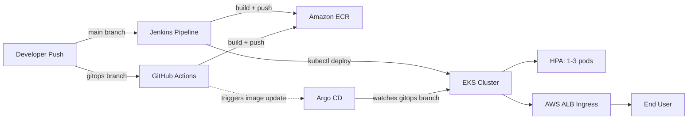

cat << 'EOF' > ~/techchallenge2/README.md
> **TL;DR:** Full-stack cloud deployment project demonstrating containerization, Infrastructure as Code, and two parallel CI/CD strategies (Jenkins and GitOps). Provisioned a production-style AWS EKS cluster from scratch with Terraform — including auto-scaling nodes, Horizontal Pod Autoscaling, and an internet-facing load balancer — then built and validated **two independent deployment pipelines**: a traditional Jenkins pipeline (`main` branch) and a modern GitOps pipeline using GitHub Actions + Argo CD + Helm (`gitops` branch). Both were tested end-to-end with live traffic before infrastructure teardown.

---

# Tech Challenge 2 — Application Deployment

A simple "Hello, World!" web app deployed via Docker, Terraform, AWS EKS, and CI/CD — implemented two ways: **Jenkins** (this branch) and **GitOps with GitHub Actions + Argo CD** (`gitops` branch).

## Architecture Overview

**Note:** The live infrastructure for this project has been torn down after evaluation to avoid ongoing AWS costs. All code, Terraform configs, Jenkins pipeline, and GitOps setup (Helm + Argo CD) remain fully functional and can be redeployed in ~20 minutes by running `terraform apply` followed by the deployment steps below — this was verified working end-to-end during development (see commit history).

## Live Application URL
http://k8s-default-techchal-5ecee2d527-572673933.us-east-1.elb.amazonaws.com
*(Note: infrastructure has since been torn down to avoid ongoing costs — see Architecture Overview above)*

## Project Overview
This project demonstrates:
- A containerized Flask web application
- Infrastructure as Code (Terraform) provisioning a full AWS EKS cluster
- Auto-scaling via Kubernetes HPA (1-3 pods, triggered at 50% CPU/memory)
- Auto-scaling node group (1-4 t3.small nodes)
- Internet-facing access via AWS ALB Ingress
- CI/CD pipeline via Jenkins (main branch)
- CI/CD pipeline via GitHub Actions + Argo CD, GitOps-style (gitops branch)

## Tech Stack
- **App:** Python / Flask
- **Containerization:** Docker
- **Infrastructure:** Terraform, AWS EKS, VPC, ALB, ECR
- **CI/CD (main):** Jenkins
- **CI/CD (gitops):** GitHub Actions + Argo CD + Helm

## Prerequisites
- AWS account with configured credentials (`aws configure`)
- Docker
- Terraform
- kubectl
- Helm
- eksctl
- GitHub CLI (optional, used for auth)

## Setup Instructions

### 1. Clone the repo
### 2. Run the app locally (optional sanity check)
### 3. Build and test the Docker image
### 4. Provision AWS infrastructure with Terraform
This creates:
- A VPC with public/private subnets across 2 availability zones
- An EKS cluster (`techchallenge2-cluster`), Kubernetes v1.33
- A managed node group: t3.small instances, auto-scaling 1 (min) to 4 (max)

### 5. Connect kubectl to the cluster
### 6. Push the app image to ECR
### 7. Deploy to EKS
Install the metrics server (required for HPA) and the AWS Load Balancer Controller (required for the ALB Ingress) — see Deployment Steps below for full details.

## Deployment Steps
1. **Metrics Server** — required for HPA to read CPU/memory usage:
2. **AWS Load Balancer Controller** — required for the ALB Ingress to provision a real load balancer:
   - Create IAM policy from the official `iam_policy.json`
   - Create an IAM service account via `eksctl create iamserviceaccount`
   - Install via Helm: `helm install aws-load-balancer-controller eks/aws-load-balancer-controller`
3. Apply the Deployment, Service, HPA, and Ingress manifests in `/k8s`
4. Wait 1-3 minutes for the ALB to provision, then retrieve the URL:

## Terraform Code Explanation
- **provider.tf** — configures the AWS provider and region (us-east-1)
- **vpc.tf** — provisions a VPC using the official `terraform-aws-modules/vpc` module, with public subnets (for the ALB) and private subnets (for worker nodes)
- **eks.tf** — provisions the EKS cluster using the official `terraform-aws-modules/eks` module, with a managed node group scaling 1-4 t3.small nodes, cluster-creator admin access enabled, and KMS/CloudWatch log group creation disabled (to work within available IAM permissions)

## Jenkins Pipeline Explanation
The `Jenkinsfile` defines a 4-stage pipeline that runs on the `main` branch:
1. **Checkout** — pulls the latest code from GitHub
2. **Build Docker Image** — builds the image, tags it with both the Jenkins build number and `latest`
3. **Push to ECR** — authenticates to Amazon ECR using AWS credentials stored in Jenkins' credential store, pushes both tags
4. **Deploy to EKS** — updates kubeconfig, then uses `kubectl set image` to roll out the new image to the live deployment, waiting for the rollout to complete

## GitOps Alternative Explanation (gitops branch)
On the `gitops` branch, deployment follows a GitOps pattern instead of Jenkins:
- **`techchallenge2-chart/`** — a Helm chart packaging the Deployment, Service, Ingress, and HPA, templated via `values.yaml`
- **`.github/workflows/build-and-push.yml`** — GitHub Actions workflow that triggers on every push to `gitops`; builds the Docker image and pushes it to ECR (tagged with the commit SHA and `latest`)
- **`argocd-application.yaml`** — an Argo CD Application resource that watches the `gitops` branch's `techchallenge2-chart` folder, with automated sync and self-healing enabled

Argo CD is installed in the `argocd` namespace on the same EKS cluster, and continuously reconciles the live cluster state to match what's defined in the Helm chart on GitHub — any future push to `gitops` is automatically built (via GitHub Actions) and deployed (via Argo CD), with no manual `kubectl` or `helm` commands required.

## Repository Structure
EOF
